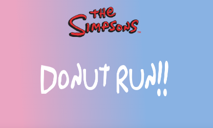

# THE SIMPSONS, DONUT RUN!!

## [Play the Game!](https://dsanchezva.github.io/the-simpsons-donut-run/)

# Description

The Simpsons Donut Run is a simple game where Homer have to eat to much Donut you can in case you eat a beoccoli you lose one live. Homer have 3 lifes and the game end if you lose all of them. Every level up one random object will appear in the game and this can give you more power or speed up the fall of objects.

# Main Functionalities

- You can move with Homer horizontally to catch the donut and avoid the broccoli.
- The object appears in the game are randomly with a probability of 60% broccoli and 40% donut.
- Every 5 donut will level up.
- Every level up will simultaneously speed up the drop down and increase the amount of objects dropped.
- Every level up will appear in the game bottle of duff beer or a bar of plutonium 50% random.
- In case you take the Duff Beer homer becomes Super Homer and you can hit the broccolis and make them disappear from the game screen for 15 seconds.
- In case you take the plutonium bar all the objects in the game screen and the new spoon object will speed up and will increase the amount of objects dropped for 4 seconds.

# Backlog Functionalities

- Add diferent characters and diferent drop items.
- Add scoreboard at the end of the game.

# Technologies used

- HTML
- CSS
- JavaScript
- DOM manipulation
- JS classes
- JS Audio()
- GitHub

# States

- Start Screen
- Game Screen
- Game Over Screen

# Proyect Structure

## main.js

- startGame()
- restartGame()
- soundStart()
- soundEnd()

## game.js

- Game ()
  - this.gameIsOn;
  - this.homer;
  - this.gameObjectsArr;
  - this.comodinObjectsArr;
  - this.timer;
  - this.dificultUp;
  - this.level;
  - this.point;
  - this.lives;
  - this.speedObstacles;
  - this.superHomer;
  - this.superKick;
  - this.superVelocidad;
  - this.audioOuch;
  - this.audioYuhu;
  - this.audioGolpe;
- levelUp()
- undateInfo()
- obstacleAppear()
- comodinAppear()
- obstaclesDisapear()
- collisionObstacles()
- superSpeed()
- sonidoColisionBrocoli()
- sonidoColisionDonut()
- sonidoGolpe()
- gameOver()
- backgroundChange()
- gameLoop()

## homer.js

- Homer ()
  - this.homerNode;
  - this.x;
  - this.y;
  - this.w;
  - this.h;
- movementLeft ()
- movementRight ()

## obstacle.js

- Obstacle (randomPoss, donut, speed, randomkick)
  - this.isKicked;
  - this.randomkick;
  - this.rotation;
  - this.randomPoss;
  - this.donut;
  - this.speed;
  - this.obstacleNode;
  - this.x;
  - this.y;
  - this.w;
  - this.h;
- movement ()
- donutRotation ()

## comodin.js

- Comodin (randomPoss, beer, speed)
  - this.rotation;
  - this.randomPoss;
  - this.beer;
  - this.speed;
  - this.x;
  - this.y;
  - this.w;
  - this.h;
- movement ()
- comodinRotation ()

# Extra Links

### Sketch

[Link](https://excalidraw.com/#json=nuuzMnBGAvtaAFCXmnoR5,iiMv7u8njc-WikPnsVPXPg)

### Trello

[Link](https://trello.com/b/lAKCubBR/the-simpsons-donut-run)

### Slides

[Link](www.your-slides-url-here.com)

## Deploy

[Link](https://dsanchezva.github.io/the-simpsons-donut-run/)
